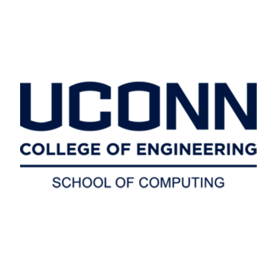
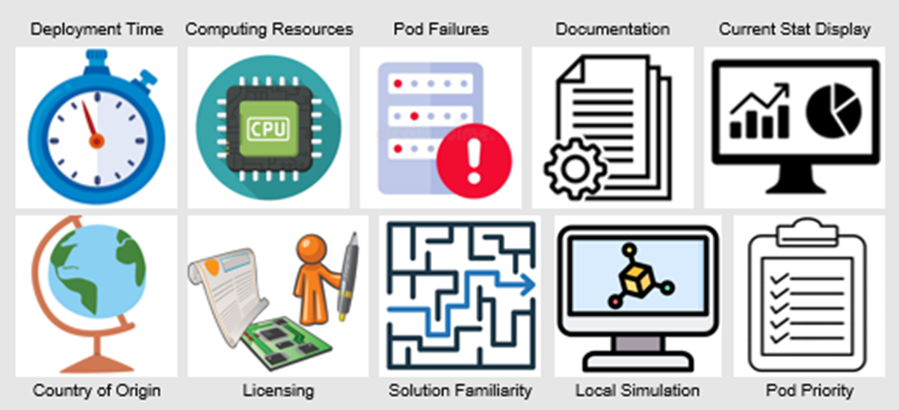
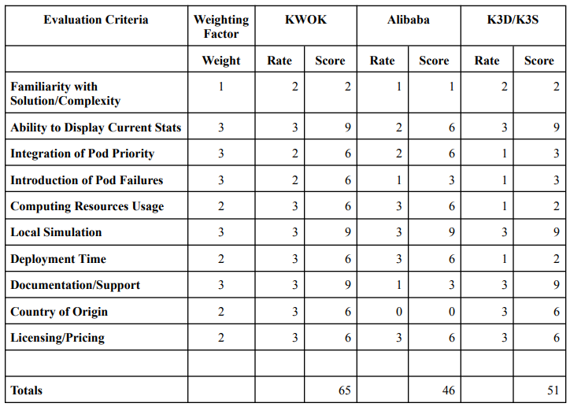
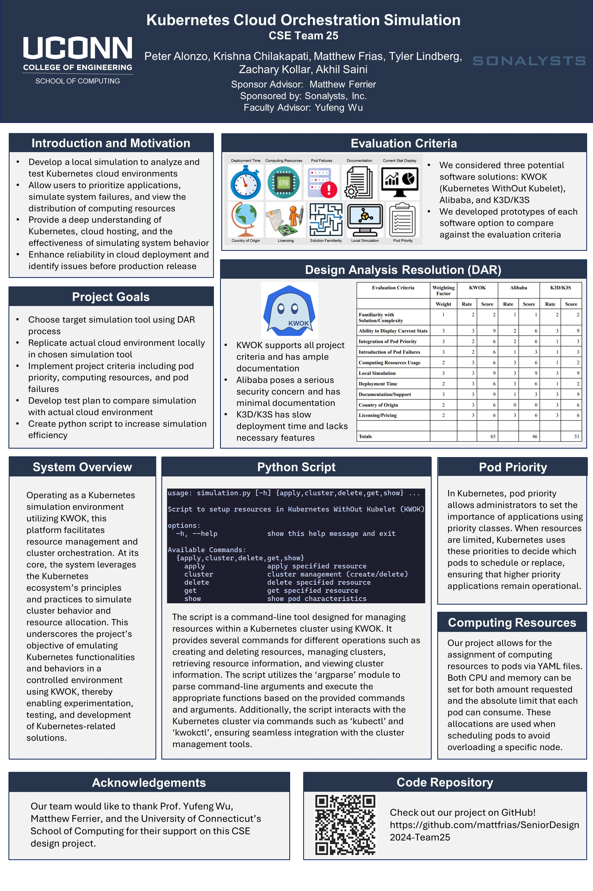

<h1 align="center">
  <a href="https://www.cse.uconn.edu/"></a><br>
  <a href="https://www.sonalysts.com/"></a>
  <br>
  <span>CSE Senior Design - Team 25</span><br>
  <span>Kubernetes Cloud Orchestration Simulation</span>
</h1>

<p align="center"><em>Peter Alonzo, Krishna Chilakapati, Matthew Frias, Tyler Lindberg, Zachary Kollar, Akhil Saini</em></p>

## Table of Contents

- [Project Goals](#project-goals)
- [Evaluation Criteria](#evaluation-criteria)
- [Decision Analysis Report](#decision-analysis-report)
- [Key Features](#key-features)
- [How To Use](#how-to-use)
- [Poster](#poster)
- [Video Presentation](#video-presentation)
- [Credits](#credits)
- [Acknowledgements](#acknowledgements)

## Project Goals

- Identify cloud environment for actual system to model
- Identify target simulation tool using DAR process
- Replicate actual cloud environment in simulation tool through development
- Develop test plan to compare simulation with actual cloud environment
- Conduct testing, update simulation if needed
- Create video, poster board and final report of findings
- Work together as a team to evenly divide tasks/work load

## Evaluation Criteria

<p align="center">
  
</p>

- We conducted introductory research to identify three potential software solutions, then delved deeper into each option to gain a comprehensive understanding
- We developed prototypes and demos for each software option, presenting them to the team and sponsor for evaluation against the predefined criteria

## Decision Analysis Report

<p align="center">
  
</p>

### Summary

- KWOK is lightweight, supports all project requirements, and has ample documentation for reference
- Alibaba poses a security concern with the codebase’s country of origin and has minimal documentation available
- K3D/K3S has slow deployment time and does not support all project requirements

## Key Features

- Manage Kubernetes Resources: Deploy, manage, and delete Kubernetes resources using a command-line interface
- Cluster Management: Create and delete Kubernetes clusters for simulation purposes
- Flexible Resource Application: Apply resource configurations from files with the option to deploy multiple instances
- Resource Deletion: Delete specific Kubernetes resources by type and name
- Resource Retrieval: Retrieve information about Kubernetes resources by type
- Insightful Pod Characteristics: View detailed characteristics of pods, including CPU and memory requests and limits
- Node Resource Allocation: Understand resource allocation on nodes within the Kubernetes cluster
- Seamless Integration: Interact with the Kubernetes cluster using familiar tools like `kubectl` and `kwokctl`
- Versatile Tool: Suitable for experimentation, testing, and development of Kubernetes-related solutions within a simulated environment

## How To Use

To clone and run this application, you'll need [Git](https://git-scm.com), [KWOK](https://kwok.sigs.k8s.io/docs/user/installation/) and [Python](https://www.python.org/) installed on your computer. From the command line:

```bash
# Clone this repository
$ git clone https://github.com/mattfrias/SeniorDesign2024-Team25.git

# Go into the repository
$ cd SeniorDesign2024-Team25

# Run the help section of the Python script to view available commands
$ python simulation.py --help

# Add configuration files to the 'resources' folder
```

## Poster

<p align="center">
  
</p>

## Video Presentation

<p align="center">
  <a href="https://www.youtube.com/watch?v=W800Sngq3N0">
    
  </a>
</p>

## Credits

This project uses the following software:

- [Kubernetes WithOut Kubelet (KWOK)](https://kwok.sigs.k8s.io/)
- [Python](https://www.python.org/)

## Acknowledgements

Our team would like to thank Professor Yufeng Wu, our Sonalysts advisor Matthew Ferrier, and the University of Connecticut’s School of Computing for their support on this CSE design project.
